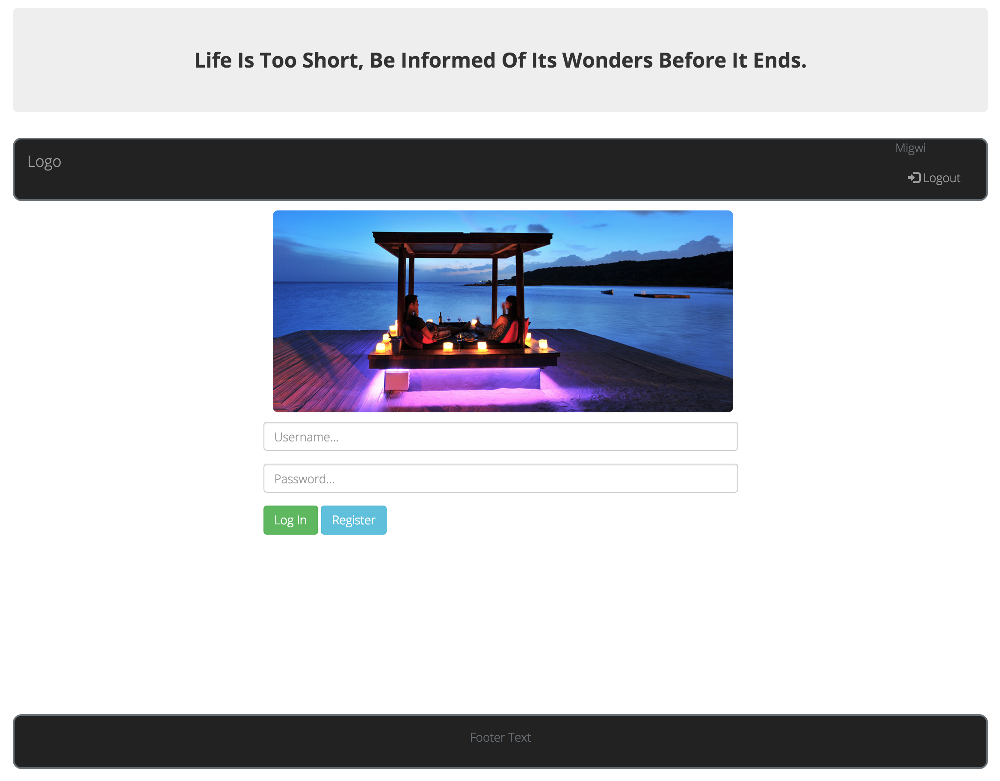
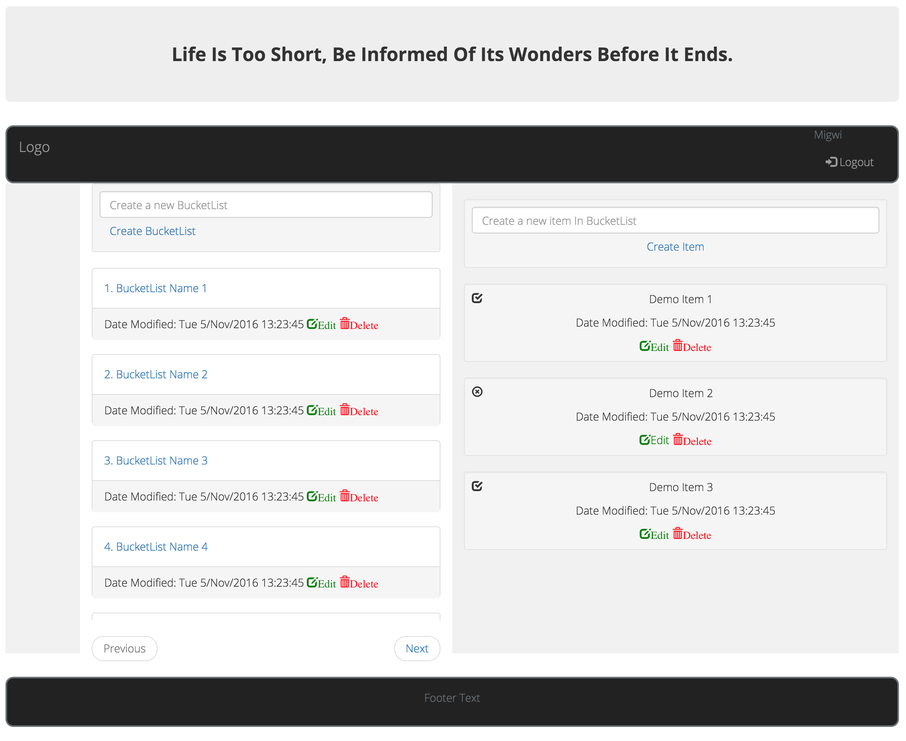

### [Be Informed B4 Life Ends]

*Life Is Too Short, Be Informed Of Its Wonders Before It Ends.*

Hosted Angular 2 app: https://be-informed.herokuapp.com

This bucketlist branch contains Frontend in angular 2

 **Landing Page**

 **Main Page**

### Project Setup
 - Clone the Branch:  
 
`git clone -b ft-angular-deploy https://github.com/andela-dmigwi/be-informed-b4-life-ends.git`

- Install the latest Node.

- Install all dependancies:
`npm install --save`

Created By [Migwi Ndung'u](https://github.com/andela-dmigwi/be-informed-b4-life-ends/edit/ft-angular-deploy) @2016
